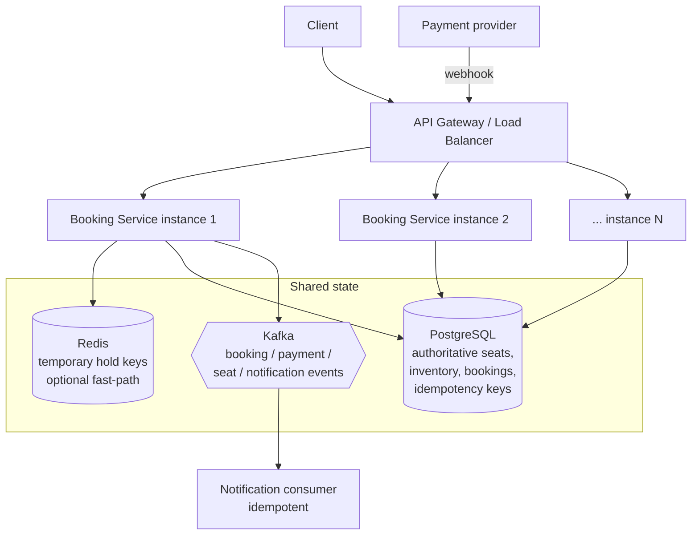
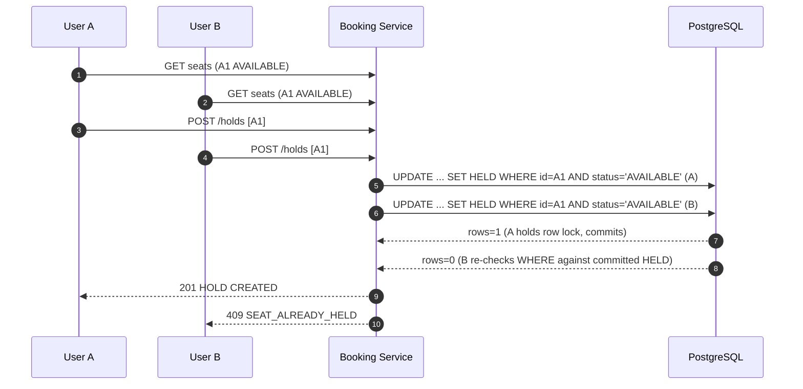
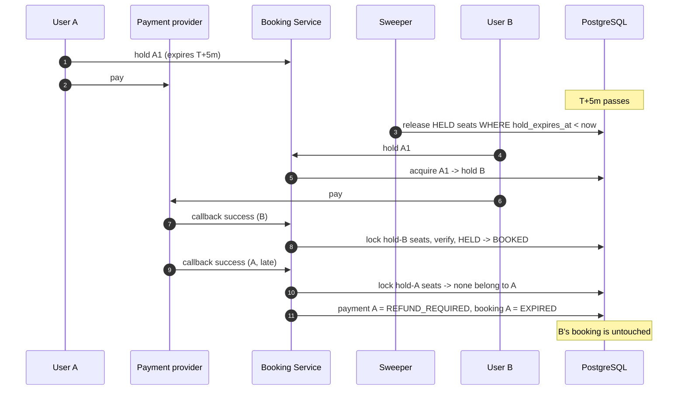
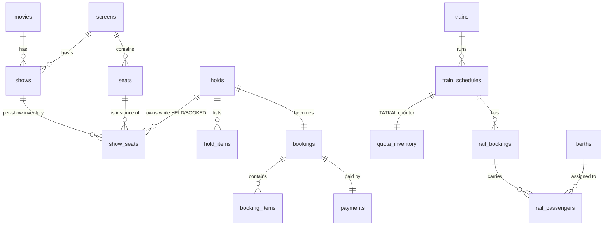

# TicketForge - High Concurrency Ticket Booking System

> Production-inspired Java/Spring Boot implementations of high-concurrency ticket reservation systems, demonstrating seat locking, temporary holds, atomic inventory allocation, idempotency, expiration, and distributed concurrency control.

**Important:** this is **not** the internal architecture of BookMyShow or IRCTC; those implementations are proprietary and not public. TicketForge contains two *reference implementations inspired by the publicly observable behaviour* of:

1. **BookMyShow-style movie seat reservation** (a user picks specific seats, which are held temporarily while paying)
2. **IRCTC Tatkal-style high-concurrency inventory allocation** (a huge crowd competes for a small quota at one instant)

The goal is educational: make the underlying distributed-systems problems *visible and testable*.

---

## Contents
1. [Problem statement](#1-problem-statement)  
2. [Why double booking happens](#2-why-double-booking-happens) 
3. [Race condition](#3-the-race-condition) 
4. [Movie architecture](#4-bookmyshow-style-architecture) 
5. [Tatkal architecture](#5-tatkal-style-architecture) 
6. [Component diagram](#6-component-diagram) 
7. [Sequence diagrams](#7-sequence-diagrams) 
8. [Schema](#8-database-schema) 
9. [Concurrency strategy](#9#10#11#12-concurrency-strategy) 
13. [Redis](#13-redis-distributed-locking) 
14. [Hold expiration](#14-hold-expiration) 
15. [Payment race](#15-payment-race-condition) 
16. [Idempotency](#16-idempotency) 
17. [Kafka](#17-kafka-events) 
18. [Scaling](#18-scaling-strategy) 
19. [Failures](#19-failure-scenarios) 
20. [CAP](#20-capconsistency-discussion) 
21. [Monitoring](#21-monitoring) 
22. [Security](#22-security) 
23. [Performance](#23-performance-considerations) 
24. [Testing](#24-testing-strategy) 
25. [Trade-offs](#25-trade-offs) 
[Run it](#run-it) 
[What this project teaches](#what-this-project-teaches) 
[Interview questions](#interview-questions-demonstrated)

---

## 1. Problem statement

`AUDITORIUM-01` has seats `A1 A2 A3`. `A1` is `AVAILABLE`. User A and User B both loaded the seat map a moment ago and both see `A1 = AVAILABLE`. They click "Book" at roughly the same instant.

**Exactly one of them may win.**

```
User A -> 201 HOLD CREATED
User B -> 409 SEAT_ALREADY_HELD        (or vice versa, never both succeed)
```

The database is the final authority. The same principle scales to Tatkal: 50,000 users, 100 berths, and the system must never allocate 101, never go negative, and never hand the same berth to two people.

## 2. Why double booking happens

*Seeing* availability and *reserving* inventory are two different operations. Between a read ("it's free") and a write ("it's mine") another request can run. The UI may show `AVAILABLE` to many users, so:

- **availability API = advisory** (cheap, cacheable, may be stale)
- **reservation API = authoritative** (one atomic state transition in the database)

## 3. The race condition

```java
// BROKEN: check-then-act
if (seat.getStatus() == AVAILABLE) {   // Thread A reads AVAILABLE
    seat.setStatus(HELD);              // Thread B also read AVAILABLE
    repository.save(seat);             // both write HELD, both think they won
}
```

```
Thread A: READ  AVAILABLE
Thread B: READ  AVAILABLE
Thread A: WRITE HELD      -> A believes it succeeded
Thread B: WRITE HELD      -> B believes it succeeded   (double booking)
```

The fix is to make "check + change" **one atomic operation inside the database**:

```sql
UPDATE show_seats
   SET status = 'HELD', hold_id = :holdId, hold_expires_at = :expiresAt
 WHERE id = :seatId
   AND status = 'AVAILABLE';
-- rowsUpdated == 1  -> you won the seat
-- rowsUpdated == 0  -> someone else got it first
```

`synchronized` and `ReentrantLock` do **not** help: they only coordinate threads inside one JVM, and production runs 20 instances behind a load balancer.

## 4. BookMyShow-style architecture

* `show_seats` is the **per-show inventory**. A physical seat `A1` is static reference data; "A1 for the 19:30 show" is the row we lock. A1 can be `BOOKED` for show Y while `AVAILABLE` for show X, which is why a physical `seats` table alone is not enough.
* Lifecycle: `AVAILABLE -> HELD (5 min) -> BOOKED`, with `HELD -> AVAILABLE` on expiry, payment failure or cancellation.
* Multi-seat holds are **all-or-nothing** in one transaction, with seats always locked in ascending id order.
* Payment confirmation re-validates, atomically, that the hold is still valid and still owns every seat before `HELD -> BOOKED`.

## 5. Tatkal-style architecture

Railway Tatkal-Style High-Concurrency Inventory Allocation: users do not choose a seat, they compete for a **quota counter**.

```
50,000 users -> Load Balancer -> Booking Services x 20 -> atomic UPDATE on ONE inventory row -> 0
```

The key statement (see `QuotaInventoryRepository.consume`):

```sql
UPDATE quota_inventory
   SET available_count = available_count - :requested
 WHERE train_schedule_id = :scheduleId
   AND quota_type = 'TATKAL'
   AND available_count >= :requested;
```

If 10,000 requests hit it concurrently, the **database**, not a Java `if`, serialises the decrement. Berths are then assigned from the returned counter (`remaining+1 .. remaining+n`, a range no other request can receive because we still hold the row lock), and `UNIQUE (train_schedule_id, berth_id)` backs this up at the schema level.

## 6. Component diagram



## 7. Sequence diagrams

### 7.1 Movie seat booking: two users, same seat



### 7.2 Tatkal allocation

```mermaid
sequenceDiagram
    autonumber
    participant U as 10,000 users
    participant WR as Waiting room (optional)
    participant S as Booking Service x N
    participant DB as PostgreSQL
    U->>WR: join queue
    WR->>S: admit N per second
    S->>DB: BEGIN; claim Idempotency-Key
    S->>DB: UPDATE quota SET available = available - n WHERE available >= n
    alt rows = 1
        S->>DB: read remaining, insert booking + passengers (berth range)
        S->>DB: COMMIT
        S-->>U: 201 confirmed
    else rows = 0
        S->>DB: ROLLBACK
        S-->>U: 409 INSUFFICIENT_INVENTORY
    end
```

### 7.3 Payment vs hold expiry race



## 8. Database schema



Full DDL is in `src/main/resources/db/migration`; every index and constraint is explained in [docs/database.md](docs/database.md). Highlights:

| Object | Purpose |
|---|---|
| `UNIQUE(show_id, seat_id)` on `show_seats` | exactly one inventory row per seat per show |
| `ck_show_seats_state` CHECK | a row cannot be `AVAILABLE` with a hold id, or `HELD` without an expiry |
| `UNIQUE(user_id, idempotency_key)` | duplicate request detection; makes retries safe |
| `bookings.hold_id UNIQUE` | one booking per hold |
| `ck_quota_available` CHECK (`0 <= available <= total`) | the counter can *never* go negative, even with buggy code |
| `UNIQUE(train_schedule_id, berth_id)` on `rail_passengers` | a berth cannot be sold twice for one journey |
| partial index `show_seats(hold_expires_at) WHERE status='HELD'` | sweeper scans only live holds |

## 9. Concurrency strategy

| Concern | Mechanism |
|---|---|
| Two users, one seat | conditional `UPDATE` (rows affected decides) **or** `SELECT ... FOR UPDATE` |
| Several seats at once | one transaction, ids sorted ascending, all-or-nothing |
| Hold expiry vs confirmation | both are state-conditional statements; row lock decides who wins |
| Duplicate requests | idempotency key committed atomically with the business effect |
| Duplicate PSP callbacks | row lock on the payment + status check |
| Tatkal counter | single atomic `UPDATE ... WHERE available_count >= :n` |
| Deadlocks / lock timeouts | bounded retry with exponential backoff and jitter, DB transient errors only |
| Cross-instance coordination | the database (and optionally Redis as a fast pre-filter) |

### Critical concurrency diagram

```
                    USER A                 USER B
                       |                      |
                       | GET seat A1          |
                       |                      |
                       | GET seat A1          |
                       |                      |
                       | AVAILABLE            |
                       |                      |
                       |--------------------->|
                       |                      |
                acquire DB lock              |
                       |                      |
                A1 -> HELD                   |
                       |                      |
                       |              acquire DB lock
                       |                      |
                       |              sees HELD
                       |                      |
                       |              HTTP 409
                       |                      |
```

Both users can **see** `AVAILABLE`. Only one can **change** the authoritative state. That distinction is fundamental.

### 10. Pessimistic locking (`PessimisticSeatAcquisition`)

```java
@Lock(LockModeType.PESSIMISTIC_WRITE)
@Query("select ss from ShowSeat ss where ss.id in :ids order by ss.id")
List<ShowSeat> lockAllOrdered(Collection<Long> ids);       // SELECT ... FOR UPDATE ... ORDER BY id
```

Lock all requested rows in id order, check each is acquirable, then mutate. A competing transaction blocks on the first locked row until we commit, then re-reads the committed state and sees `HELD`. Simple to reason about, costs queueing under contention.

**Why ordering matters.** User A asks `A1,A2`, User B asks `A2,A1`. Without a global order, A locks A1 and B locks A2, then each waits for the other: deadlock. Sorting by id gives everyone the same acquisition order, so waiting graphs cannot form cycles. (`SeatContentionIT` hammers this with opposite-order requests.)

### 11. Optimistic locking

`ShowSeat`, `Hold`, `Booking`, `Payment` carry a `@Version`. A stale write fails with `OptimisticLockException` instead of silently overwriting. It is the right tool when conflicts are *rare* (editing a booking). For the hottest paths (seat acquisition, Tatkal counter) we use the cheaper and stronger atomic UPDATE below, because under heavy contention optimistic retries waste work.

### 12. Atomic SQL updates (`AtomicSeatAcquisition`)

```java
@Modifying
@Query("""
    update ShowSeat s
       set s.status = :heldStatus, s.holdId = :holdId, s.holdExpiresAt = :expiresAt, ...
     where s.id = :seatId
       and (s.status = :availableStatus or (s.status = :heldStatus and s.holdExpiresAt < :now))
""")
int acquireSeat(...);

if (updatedRows == 1) { /* you won the seat */ } else { /* someone else got it first */ }
```

Why it works: PostgreSQL takes a row lock for the UPDATE. A second concurrent UPDATE waits, then re-evaluates its `WHERE` clause against the *committed* new row (status now `HELD`), matches nothing, and reports 0 rows. There is no window between check and write because they are one statement.

### Transaction isolation

| Level | What it gives | Fit here |
|---|---|---|
| `READ COMMITTED` (PostgreSQL default) | each statement sees committed data; conditional UPDATE re-checks `WHERE` after lock waits | **Used.** Correct for single-statement atomic transitions and `FOR UPDATE` |
| `REPEATABLE READ` | snapshot per transaction; a concurrent update to a row you read causes serialization failure | Useful for consistent multi-row reports; would turn contention into errors that need retries |
| `SERIALIZABLE` | full serial equivalence via SSI, aborts conflicting transactions | Not needed: our invariants are enforced by single-row atomic updates and constraints. Cost: more aborts, mandatory retries, lower throughput under contention |

`TransactionalRunner.run(isolationLevel, work)` supports all three so you can experiment, but the app does not blindly use `SERIALIZABLE`.

## 13. Redis distributed locking

Optional (`REDIS_ENABLED=true`). `RedisSeatLockGate` does:

```
SET seat:{showId}:{seatLabel} {holdId} NX EX 300
```

`NX` = set only if the key does not exist; `EX` = expire after 300 s so a crashed node can't hold a seat forever. Release uses a Lua compare-and-delete so a node never removes a lock someone else acquired after its TTL lapsed.

**What Redis does here:** early rejection of obvious conflicts before touching PostgreSQL (saves DB work during a stampede).
**What Redis does NOT do:** guarantee final booking consistency. A Redis lock can expire while a request is still running, Redis can fail over and lose a key, and a client can pause (GC) past its TTL. So the database transition always runs afterwards and remains authoritative. On Redis errors the gate **fails open**, falling back to database-only locking; correctness is unchanged.

`Redis + DB` is **not** a distributed transaction. They are two systems with separate failure modes; consistency comes from the DB being the source of truth and Redis only ever *rejecting early*, never *granting*.

## 14. Hold expiration

* `HoldExpiryJob` (`@Scheduled(fixedDelay = 1000)`) calls `HoldExpiryService.expireDueHolds()`.
* Statement: `UPDATE show_seats SET AVAILABLE ... WHERE status = 'HELD' AND hold_expires_at < now`. It matches only `HELD`, so it **cannot** release a `BOOKED` seat.
* Correctness never depends on the sweeper: acquisition treats a lapsed `HELD` row as acquirable, and confirmation compares `hold_expires_at` with the clock. The sweeper keeps data tidy and emits `seat.hold.expired`.
* Every instance may run the sweeper; the statements are idempotent and state-conditional. (A Redis key-expiry alternative is described in [docs/concurrency.md](docs/concurrency.md).)

## 15. Payment race condition

`PaymentService.onSuccess` runs in one transaction: lock booking, lock payment, `SELECT ... FOR UPDATE` the hold's seats, then verify (a) booking is `PAYMENT_PENDING`, (b) every seat is still `HELD` by *this* hold, (c) `hold_expires_at >= now`. Only then `HELD -> BOOKED`. Otherwise: payment becomes `REFUND_REQUIRED`, booking becomes `EXPIRED`, and **seats are not touched** (they may belong to another customer now). Admins see these via `GET /api/v1/admin/reconciliation/payments`.

Production variants worth discussing: extend the hold when payment starts, or grant a short grace period if the seat is still unclaimed.

## 16. Idempotency

`POST /api/v1/bookings` and `POST /api/v1/tatkal/reservations` require an `Idempotency-Key` header; holds accept one optionally.

* `INSERT ... ON CONFLICT (user_id, idempotency_key) DO NOTHING` claims the key **in the same transaction** as the business effect.
* Duplicate key + same payload hash -> stored response replayed (`Idempotent-Replayed: true`).
* Duplicate key + different payload -> `422 IDEMPOTENCY_KEY_REUSED`.
* If the action fails, the transaction (including the key row) rolls back, so the client can retry.

**A network timeout is not an operation failure.** The server may have committed before the response was lost; without idempotency the retry creates a second booking.

## 17. Kafka events

Topics: `booking-events`, `payment-events`, `seat-events`, `notification-events` (enable with `KAFKA_ENABLED=true`).
Events: `seat.hold.created`, `seat.hold.expired`, `booking.confirmed`, `booking.cancelled`, `booking.payment.failed`, `payment.refund.required`.

* Events are published **after commit** and keyed by aggregate id (ordering per booking).
* Delivery is **at-least-once**, so consumers must be idempotent: `NotificationConsumer` records `event_id` in `processed_events` in the same transaction as its side effect.
* Failed records are retried with exponential backoff and then parked on `<topic>.DLT`.
* Consumers are **eventually consistent**; they never decide seat ownership.
* Known gap: DB commit then Kafka send is a dual write. A crash in between loses the event. The production fix is a transactional **outbox** (see docs/failure-scenarios.md).

## 18. Scaling strategy

Stateless app instances scale horizontally; state lives in PostgreSQL/Redis/Kafka. Reads (`GET seats`, availability) go to replicas/caches because they are advisory. Writes concentrate on hot rows; see [docs/performance.md](docs/performance.md) for sharded counters, pre-allocation, queue-based admission and the waiting room (`/api/v1/waiting-room/*`, enabled with `ticketforge.waiting-room.enabled=true`).

## 19. Failure scenarios

| Failure | Behaviour |
|---|---|
| App instance crashes mid-request | transaction rolls back; no partial hold; client retries with same key |
| Client timeout after server commit | retry with same `Idempotency-Key` returns original result |
| DB deadlock / lock timeout | bounded retry with exponential backoff + jitter; business conflicts are **not** retried |
| Redis down | fail open to DB-only locking |
| Redis key expires mid-request | DB still authoritative; no double booking |
| Kafka unavailable | booking succeeds; event send failure is logged (outbox needed for guaranteed delivery) |
| Payment succeeds after hold expiry | not booked; `REFUND_REQUIRED` |
| Duplicate PSP callback | first outcome wins, later ones are no-ops |
| Sweeper not running | lapsed holds are still treated as free on acquire |

Details: [docs/failure-scenarios.md](docs/failure-scenarios.md).

## 20. CAP/consistency discussion

Seat and inventory state need **linearizable, single-writer-per-row** semantics: choose consistency over availability for the write path. During a partition, the primary DB is either reachable (correct answer) or not (reject with 503). Anything derived (seat-map caches, Kafka consumers, search) is **eventually consistent** and only advisory.

## 21. Monitoring

Actuator + Micrometer (`/actuator/prometheus`): `booking_attempts_total`, `booking_success_total`, `booking_conflicts_total`, `seat_hold_created_total`, `seat_hold_expired_total`, `payment_failures_total`, `inventory_allocation_success_total`, `inventory_allocation_conflict_total`, plus `db_transient_retries_total`, `payment_reconciliation_required_total`, `idempotency_replays_total`, HTTP latency histograms.

Watch in production: conflict ratio, p99 hold/reservation latency, DB lock waits and deadlock counters (`pg_stat_database.deadlocks`), connection-pool saturation, retry rate, `REFUND_REQUIRED` backlog (should be near zero), sweeper lag, Kafka consumer lag and DLT depth. Every request carries a correlation id (`X-Correlation-Id`, in logs as `correlationId`, in error `traceId`); use `SPRING_PROFILES_ACTIVE=json` for structured logs.

## 22. Security

Spring Security, stateless JWT (HS256, secret from `JWT_SECRET`), roles `USER`/`ADMIN`. Hold owner must match the token subject; holds/bookings/reservations of other users return 404 (no existence leak); the PSP webhook uses a constant-time shared-secret check; public identifiers are opaque (`HOLD-…`, `BKG-…`, `RES-…`), not database ids; request bodies are validated. `POST /api/v1/auth/token` is a **demo-only** token issuer (disable with `ticketforge.security.dev-token-endpoint-enabled=false`).

## 23. Performance considerations

The Tatkal row is a **hot row**: all writers serialise on it. Throughput is bounded by commit latency of that row. Keep the transaction short, put the atomic UPDATE as early as it can be while still returning berth numbers, size the pool to the database (not to the number of users), and shed load before the DB (waiting room, rate limiting). See [docs/performance.md](docs/performance.md).

## 24. Testing strategy

| Type | Where |
|---|---|
| Unit | `BookingStatusTest`, `TransactionalRunnerTest`, `WaitingRoomServiceTest`, `InMemoryRaceDemoTest` |
| Repository | `ShowSeatRepositoryIT` (rowsUpdated 1 vs 0, expired takeover) |
| Concurrency | `SeatContentionIT`, `InventoryRaceIT`, `TatkalReservationIT` |
| Integration (Testcontainers/PostgreSQL) | `HoldLifecycleIT`, `BookingFlowIT` |
| Controller (MockMvc + JWT) | `HoldControllerIT`, `TatkalReservationIT` |
| Load | `load-tests/tatkal.js` (k6) |

Covered scenarios: two users one seat; 100 users one seat; 1,000 users / 100 seats; hold expiry; payment before/after expiry; late payment vs new owner; duplicate callback; duplicate booking request; opposite-order multi-seat (deadlock avoidance) and retry logic; inventory never negative; seat never booked twice; Unsafe vs Safe inventory; competing "instances" (all threads share only the DB, exactly like separate JVMs would).

`UnsafeInventoryService` is deliberately broken (read, sleep, write) and only exists when `ticketforge.demo.unsafe-inventory-enabled=true`. `InventoryRaceIT` asserts it over-allocates and that `SafeInventoryService` allocates exactly 100.

## 25. Trade-offs

* Atomic UPDATE vs `FOR UPDATE`: both implemented, selectable per request (`?strategy=ATOMIC|PESSIMISTIC`). Atomic is leaner under contention; pessimistic reads more naturally when business rules need to inspect rows first.
* Redis gate adds a failure mode and a stale-lock window in return for less DB load; it is off by default.
* Lazy expiry makes correctness independent of the sweeper, at the cost of slightly more complex `WHERE` clauses.
* Strict hold deadline (no grace period) is simple but converts slow payments into refunds.
* Event publishing is after-commit, not outbox-based: simple, but can lose events on crash.
* Hold creation does not reject past `starts_at` so the demo data keeps working; add that check for real use.
* The waiting room is single-JVM/in-memory (illustrative).
* Schema is managed by Flyway with `ddl-auto: none`.

---

## Run it

Prerequisites: JDK 21, Docker. `./mvnw` uses `mvn` if installed, otherwise downloads Maven once (or run `mvn -N wrapper:wrapper` to generate the official wrapper).

```bash
# 1. configuration (no secrets are hard-coded)
cp .env.example .env            # edit the values
set -a; source .env; set +a

# 2. tests (needs Docker for Testcontainers; those tests skip if Docker is absent)
./mvnw test

# 3a. everything in containers (postgres + redis + kafka + app)
docker compose up --build

# 3b. or infrastructure in Docker, app on your machine
docker compose up -d postgres redis kafka
./mvnw spring-boot:run
```

### Curl walkthrough (app on `localhost:8080`)

```bash
BASE=http://localhost:8080/api/v1
TOKEN_A=$(curl -s -X POST $BASE/auth/token -H 'Content-Type: application/json' -d '{"userId":"user-101"}' | sed 's/.*"token":"\([^"]*\)".*/\1/')
TOKEN_B=$(curl -s -X POST $BASE/auth/token -H 'Content-Type: application/json' -d '{"userId":"user-102"}' | sed 's/.*"token":"\([^"]*\)".*/\1/')

# Advisory seat map (public)
curl -s $BASE/shows/SHOW-AVENGERS-1930/seats

# USER A holds A1 -> 201
curl -i -X POST $BASE/shows/SHOW-AVENGERS-1930/holds -H "Authorization: Bearer $TOKEN_A" \
  -H 'Content-Type: application/json' -d '{"userId":"user-101","seatIds":["A1"]}'
# {"holdId":"HOLD-...","status":"HELD","expiresAt":"2026-10-09T10:05:00Z","seatIds":["A1"]}

# USER B holds A1 -> 409
curl -i -X POST $BASE/shows/SHOW-AVENGERS-1930/holds -H "Authorization: Bearer $TOKEN_B" \
  -H 'Content-Type: application/json' -d '{"userId":"user-102","seatIds":["A1"]}'
# {"timestamp":"...","status":409,"code":"SEAT_ALREADY_HELD","message":"One or more selected seats are no longer available","traceId":"..."}

# A books, then the (simulated) payment provider calls back
curl -s -X POST $BASE/bookings -H "Authorization: Bearer $TOKEN_A" -H "Idempotency-Key: $(uuidgen)" \
  -H 'Content-Type: application/json' -d '{"holdId":"HOLD-..."}'
curl -s -X POST $BASE/payments/callback -H "X-Webhook-Secret: $PAYMENT_WEBHOOK_SECRET" \
  -H 'Content-Type: application/json' -d '{"paymentRef":"PAY-...","outcome":"SUCCESS"}'

# (instead of paying) wait 5 minutes: the hold lapses and USER B's retry succeeds
curl -i -X POST $BASE/shows/SHOW-AVENGERS-1930/holds -H "Authorization: Bearer $TOKEN_B" \
  -H 'Content-Type: application/json' -d '{"userId":"user-102","seatIds":["A1"]}'

# Tatkal
curl -s "$BASE/trains/12951/availability?journeyDate=2026-11-15"
curl -s -X POST $BASE/tatkal/reservations -H "Authorization: Bearer $TOKEN_A" -H "Idempotency-Key: $(uuidgen)" \
  -H 'Content-Type: application/json' \
  -d '{"trainNo":"12951","journeyDate":"2026-11-15","passengers":[{"name":"Asha","age":31}]}'
```

### Concurrency and load tests

```bash
# the headline concurrency tests (prints stats: requests, success, rejected, time, throughput, failure rate)
./mvnw test -Dtest='SeatContentionIT,InventoryRaceIT,TatkalReservationIT'

# k6 load test: 10,000 users, 100 berths (see load-tests/README.md)
k6 run -e BASE_URL=http://localhost:8080 load-tests/tatkal.js
```

### Git

```bash
git init
git add .
git commit -m "feat: add high concurrency ticket booking system"
git branch -M main
git remote add origin <GITHUB_REPOSITORY_URL>
git push -u origin main
```

---

## What this project teaches

* **Database locking** - row locks, `SELECT ... FOR UPDATE`, lock ordering
* **Race conditions** - check-then-act, lost updates, reproduced in tests
* **Atomic updates** - conditional UPDATE as compare-and-set
* **Distributed systems** - why per-JVM locks fail, shared source of truth
* **Idempotency** - retry-safe APIs, request hashing, atomic key claiming
* **Inventory management** - per-show inventory, quota counters, no negative stock
* **Redis** - `SET NX EX`, safe release, fail-open, why it is not the source of truth
* **Kafka** - at-least-once, idempotent consumers, DLT, after-commit publishing
* **Payment consistency** - late payment vs expired hold, reconciliation
* **Transaction boundaries** - retry outside the transaction, all-or-nothing multi-seat
* **High concurrency** - hot rows, admission control, waiting room
* **Observability** - metrics, correlation ids, what to alert on
* **Testing** - Testcontainers, virtual-thread stampedes, deterministic clocks

## Interview questions demonstrated

1. **How do you prevent double booking?** Make the state transition atomic in the database: `UPDATE ... WHERE status='AVAILABLE'` and check rows affected (or `SELECT ... FOR UPDATE`). Reads are advisory; only the conditional write is authoritative. Add constraints as a backstop.
2. **Why isn't `synchronized` enough?** It only excludes threads in one JVM. With N instances behind a load balancer, two requests for one seat land in different JVMs and both enter their own critical section. The lock must live in shared state (DB/Redis).
3. **Optimistic vs pessimistic locking?** Optimistic: no lock, detect conflict at write via version, retry on failure; good for low contention. Pessimistic: lock rows up front; good for high contention or when work between read and write is non-trivial, at the cost of waiting and deadlock risk.
4. **Why use `SELECT FOR UPDATE`?** It locks the rows you will modify so no one can change them between your read and write, and waiters re-read committed data after the lock releases.
5. **How does atomic UPDATE prevent overselling?** The guard (`available_count >= :n`) and decrement are one statement evaluated under the row lock; concurrent callers are serialised and each sees fresh data, so the counter can't go below zero and only `rows==1` callers succeed.
6. **How do you handle payment timeout?** The hold has a deadline; if payment is not confirmed in time the seat returns to inventory. A late success is not auto-booked; it is parked for refund unless the hold is still valid and owned.
7. **What if payment succeeds after seat expiry?** Confirmation re-verifies hold ownership, expiry and seat state under row locks. If any fails the payment becomes `REFUND_REQUIRED` and the new owner's booking is untouched.
8. **How does Redis locking work?** `SET key holdId NX EX ttl` atomically creates the key only if absent with an expiry; release with a Lua compare-and-delete. It gives cheap mutual exclusion with auto-release.
9. **Why can't Redis alone guarantee durable booking?** Keys expire under slow requests, failover can lose acknowledged writes, clients can pause past TTL, and Redis isn't the durable record. Final state must be committed in the database.
10. **How do you handle 50,000 users for Tatkal?** Shed and shape load before the DB (waiting room, rate limits), keep the DB path a single short atomic statement, make requests idempotent, scale stateless app nodes, and use sharded/pre-allocated inventory if one row becomes the ceiling.
11. **What is a hot row?** A single row that all concurrent writers need (e.g. the Tatkal counter). They serialise on its lock, so throughput is capped by that row's commit latency regardless of how many app nodes you have.
12. **How do you reduce DB contention?** Shorter transactions, fewer round trips, atomic single statements, queue/waiting-room admission, sharded counters, caching of reads, early rejection (Redis), right-sized connection pools.
13. **How does idempotency work?** Client sends a unique key; server claims it atomically with the business effect (unique constraint), stores the response, and replays it for duplicates; a different payload under the same key is rejected.
14. **How do you handle duplicate Kafka events?** At-least-once delivery means duplicates are normal. Consumers dedupe on event id (`processed_events`) in the same transaction as their side effect, or make the effect naturally idempotent.
15. **What happens during DB failure?** Writes fail fast (503), nothing is half-committed because transactions are atomic; clients retry with idempotency keys; failover to a replica must preserve committed data (synchronous replication) or accept re-validation.
16. **What happens during Redis failure?** The gate fails open: requests go straight to the DB, which stays correct but sees more load. Locks left in Redis expire by TTL.
17. **What if Kafka is unavailable?** Booking still succeeds (state is in the DB). Events are lost unless you use an outbox that relays after Kafka recovers; consumers are eventually consistent.
18. **How do you design seat inventory?** Static physical seats plus a per-show `show_seats` row carrying status, hold id, expiry and version; unique `(show, seat)`, state CHECK constraint, indexes for the seat map and sweeper.
19. **Why should `ShowSeat` exist?** Seat A1 is a different resource for each show. Locking the physical seat would block A1 for every show; per-show inventory isolates contention and models state correctly.
20. **Why is deterministic lock ordering important?** If transactions acquire multiple locks in different orders they can wait on each other in a cycle (deadlock). A global order (sorted ids) makes cycles impossible.
21. **How do you prevent negative inventory?** Conditional decrement in one statement, plus a `CHECK (available_count >= 0)` constraint as defence in depth.
22. **How do you scale horizontally?** Stateless app instances behind a load balancer sharing PostgreSQL/Redis/Kafka; read replicas and caches for advisory reads; partition by show/train for write scaling; no JVM-local state for correctness.
23. **What consistency model is required?** Strong (linearizable) consistency per seat/counter on the write path; eventual consistency is acceptable for caches, seat-map views and event consumers.
24. **Why isn't SERIALIZABLE always the answer?** It adds abort/retry overhead and reduces throughput under contention, and our invariants are already guaranteed by single-row atomic updates and constraints. Use it only where multi-row invariants cannot be expressed otherwise.
25. **How would you handle 1 million concurrent requests?** Don't let them reach the database: CDN/edge rate limiting, a virtual waiting room that admits at the DB's sustainable rate, Redis/queue-based admission, sharded inventory (e.g. per-coach counters), regional capacity planning, graceful degradation (`429/503` with retry hints), and idempotent clients.
26. **How do you retry deadlocks safely?** Retry only transient DB errors (deadlock loser, lock timeout, serialization failure), outside the transaction, with bounded attempts and exponential backoff plus jitter; never retry business conflicts.
27. **How do you test concurrency reproducibly?** Release N virtual threads from one start latch against a real PostgreSQL (Testcontainers), widen the race window with a pause in the broken implementation, assert invariants (success count, distinct holders, non-negative counter) rather than timings.

## Documentation

[docs/architecture.md](docs/architecture.md) 
[docs/concurrency.md](docs/concurrency.md) 
[docs/database.md](docs/database.md) 
[docs/failure-scenarios.md](docs/failure-scenarios.md) 
[docs/performance.md](docs/performance.md) 
[docs/interview-guide.md](docs/interview-guide.md)

## License

UNLICENSE
