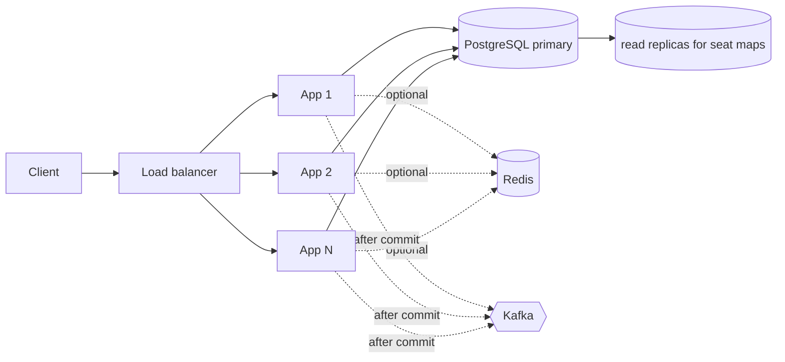

# Architecture

TicketForge contains two reference implementations *inspired by* public behaviour of BookMyShow-style seat booking and IRCTC Tatkal-style quota allocation. It does not claim to reproduce either company's internals.

## Layers

```
controller  -> HTTP, validation, identity (CurrentUser), idempotency headers
service     -> business rules, transaction boundaries (TransactionalRunner)
repository  -> Spring Data JPA, the atomic UPDATEs and FOR UPDATE queries
domain      -> entities with state-transition rules (Booking.transitionTo)
infrastructure -> db retry, events, kafka, redis gate
```

Package layout: `common`, `config`, `security`, `idempotency`, `payment`, `movie`, `railway`, `waitingroom`, `infrastructure`.

## Runtime topology



## Request flow: hold

1. `HoldController` validates body, resolves `CurrentUser`.
2. `HoldService` checks ownership, normalises + sorts seat labels.
3. Optional `SeatLockGate` (Redis) may reject early.
4. `IdempotencyService` (if a key was sent) or `TransactionalRunner` opens a transaction (with bounded retry for transient DB errors).
5. Inside the transaction: resolve show_seat ids (ascending), insert `holds`, run the chosen `SeatAcquisitionStrategy`, insert `hold_items`, queue `seat.hold.created`.
6. Commit; the event is relayed after commit.

## Request flow: booking and payment

`POST /bookings` locks the hold row, validates it, creates `booking` (`INITIATED -> PAYMENT_PENDING`) + `payment (PENDING)`. The PSP calls `POST /payments/callback`; `PaymentService` locks booking, payment and the hold's seats in that order, validates, then confirms or parks for refund.

## State machines

Booking: `INITIATED -> PAYMENT_PENDING -> CONFIRMED -> CANCELLED`; `PAYMENT_PENDING -> PAYMENT_FAILED | EXPIRED | CANCELLED`; `INITIATED -> CANCELLED | EXPIRED`. Terminal: `PAYMENT_FAILED`, `CANCELLED`, `EXPIRED`. Enforced in `BookingStatus` and `Booking.transitionTo` (422 `INVALID_STATE_TRANSITION`).

Seat: `AVAILABLE -> HELD -> BOOKED`, `HELD -> AVAILABLE` (expiry/failure/cancel), `BOOKED -> AVAILABLE` (cancel). Backed by a CHECK constraint.

Hold: `ACTIVE -> CONFIRMED | EXPIRED | RELEASED`. Payment: `PENDING -> SUCCEEDED | FAILED | REFUND_REQUIRED`.

## Source of truth

PostgreSQL. Redis only rejects early. Kafka only distributes facts that are already committed. Anything cached or derived is advisory.
